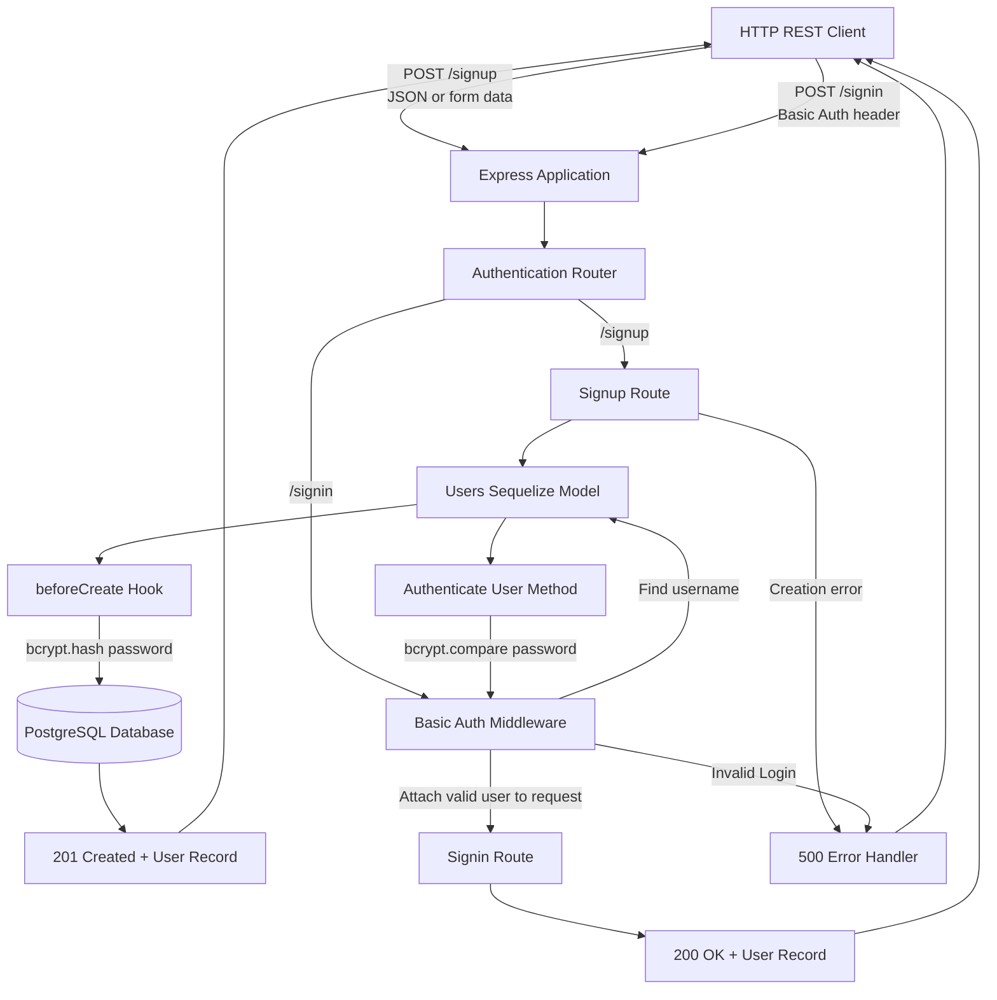

# basicAuth
401 /// module_2 /// lab_06 /// authentication

## UML

## Changelog

- imported starter code from class repo.
- created missing `package-lock.json` file with `npm install`.
- created `.env.example`.
- added `UML` as mermaid to document both required flows:
  - Signup hashes the password through a model hook before database storage.
  - Signin delegates credential validation to middleware and a model method.
  - Successful and unsuccessful outcomes return through Express.
- created `/src/server.js`.
- extracted user schema and authen rules, 'moved password handling out of route code, allowing users created through sequelize to automatically get same protection.
- created `src/auth/models/index.js` for Sequelize config, and user and db exportation.
- created `src/auth/middleware/basic.js`.
- created `src/auth/router.js`.
- created error handlers `src/middleware/404.js` and `src/middleware/500.js`.
- imported `authRouter`, `handleNotFound`, and `handleServerError` to `server.js`.
- fixed `cors` variabe name; `server.js`; which i just learned might not be needed at all, since 
  - there is no frontend,
  - is middleware, but not generally required for Express mw / basic authen..
- created `~/index.js`; which;
  - loads `env` variables,
  - imports `db` / `sequelize` connection from `./src/auth/models/index.js`,
    - `start()` from `./src/server.js`,
  - creates / syncs db tables,
  - and begins listening after db is ready
  - lets Supertestimport express `app` w/o postgresql / starting deployed server 
- changed project entry point from `app.js` (supplied starter) to `index.js` (modular entry); `package.json`
- added supertest (from root); `npm install --save-dev supertest`
- created `/__tests__/server.test.js` for route integration testing.
- created `basics.test.js` for middleware testing.
- import and paths; `server.test.js`.
- relocated `basic.test.js` to `~/src/auth/middleware/`.