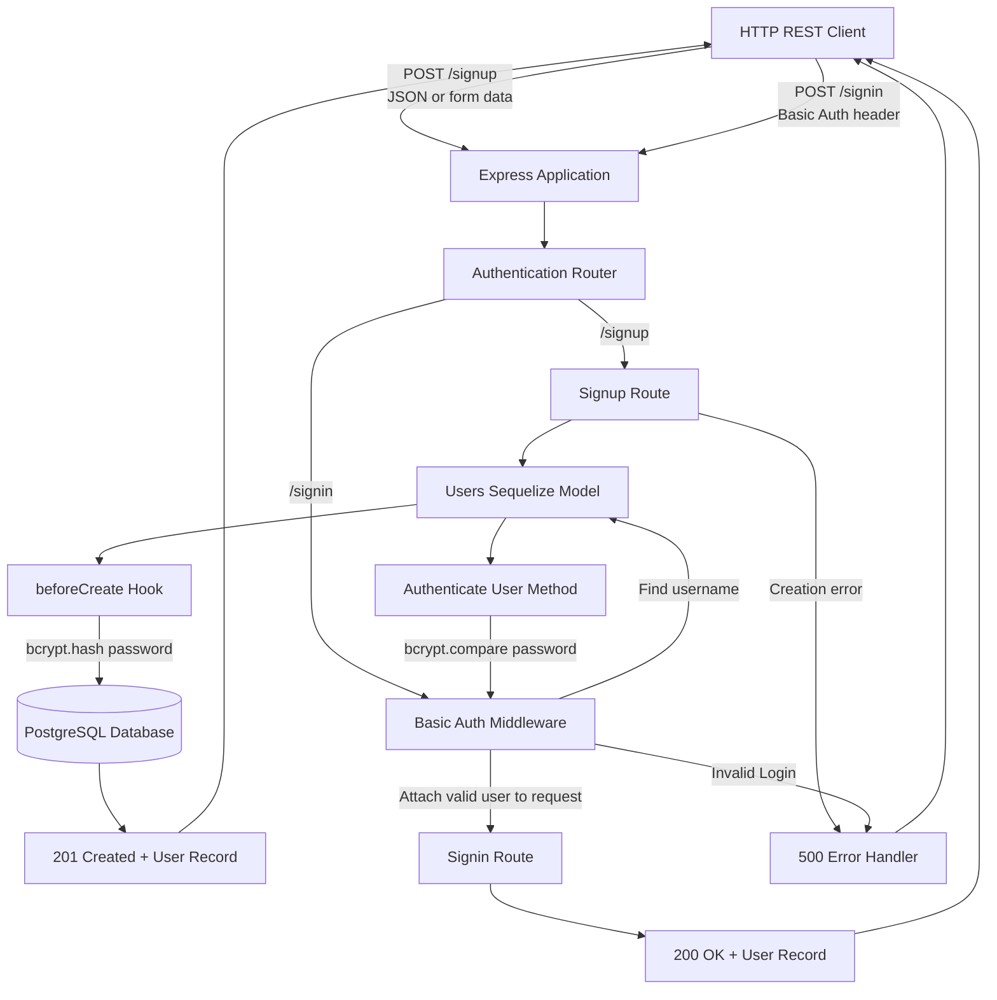

# basicAuth
401 /// module_2 /// lab_06 /// authentication

## UML

## Changelog

- imported starter code from class repo.
- created missing `package-lock.json` file with `npm install`.
- created `.env.example`.
- added `UML` as mermaid to document both required flows:
  - Signup hashes the password through a model hook before database storage.
  - Signin delegates credential validation to middleware and a model method.
  - Successful and unsuccessful outcomes return through Express.