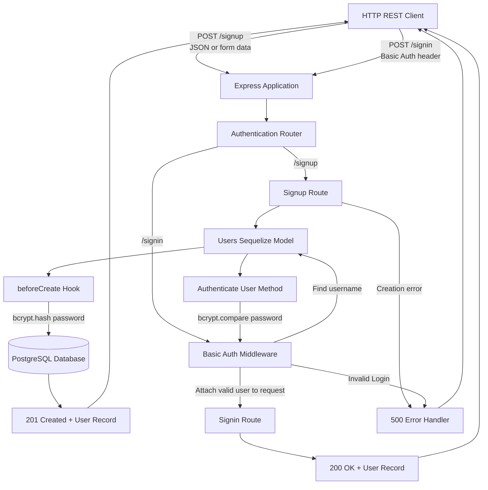

# basicAuth
401 /// module_2 /// lab_06 /// authentication

## UML

## Running and testing locally

Create a PostgreSQL database and set `DATABASE_URL` in a local `.env` file using `.env.example` as a guide. Run `npm start` to start the server. Run `npm test -- --runInBand` to run the automated tests.

## AI assistance

Codex was used as a programming assistive tool while refactoring the starter server. It suggested the module structure, example implementations for the authentication model, middleware, routes, and error handlers, and initial Jest/Supertest tests. I manually entered and revised the code, reviewed errors with Codex, and ran the tests and HTTP requests myself.

A relevant excerpt from my initial prompt was:

> “The goal is to refactor the starter into a modular Express authentication server with PostgreSQL, Sequelize, Basic Authentication, signup/signin routes, error middleware, Jest/Supertest tests, and a Mermaid UML in README.md.”

## Implementation and verification

- Refactored the starter into a separate entry point, Express app, authentication router, user model, and middleware.
- Signup accepts JSON or form data, hashes passwords before storage, and returns 201.
- Signin validates Basic Authentication and returns the authenticated user with 200.
- User responses omit the stored password hash.
- Automated testing: 7 Jest/Supertest tests passed with `npm test -- --runInBand`.
- Manual PostgreSQL testing: `/signup` returned 201 and `/signin` returned 200.